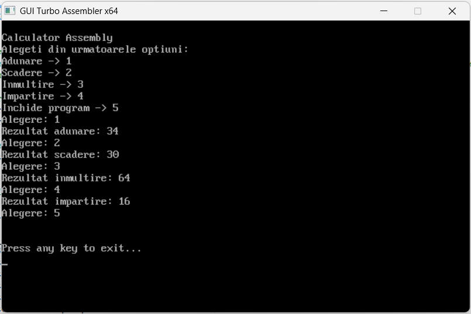
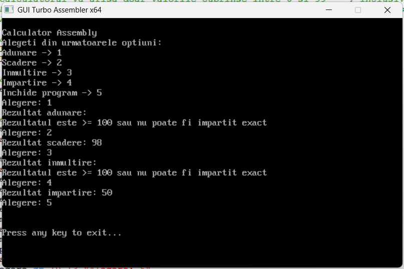

# calculator-assembly

A simple calculator written in x86 Assembly using TASM (Turbo Assembler) that performs basic arithmetic operations including:

- Addition
- Subtraction
- Multiplication
- Division

The program takes two input values and performs the selected operation.

<h2> Example 1: Input values 32 and 2 </h2>

<h2> Example 2: Input values 100 and 2 </h2>

This calculator allows for simple arithmetic operations with results displayed on the screen. Note that it supports values between 0 and 99.

## How to Run

1. Install TASM (Turbo Assembler) to compile and run the Assembly code.
2. Clone this repository.
3. Assemble the code using TASM.
4. Run the generated executable.

